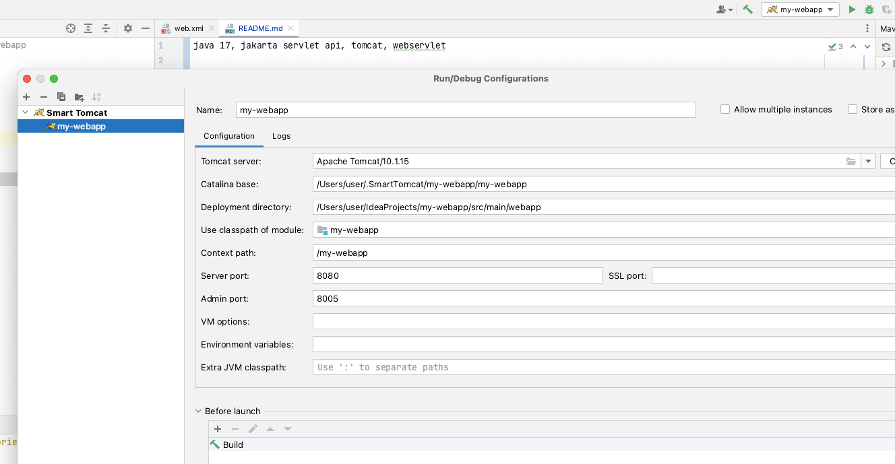

jakarta servlet api, tomcat, webservlet, java 17

Как запустить: 
1. качаем plugin для idea smart tomcat
2. в плагине указываем путь до папки с Tomcat Server (предварительно скачав с интернета tomcat.zip и распаковав его кудато рядом)
3. В deployment directory указываем путь до папки webapp как на скриншоте 
4. Запускаем проект